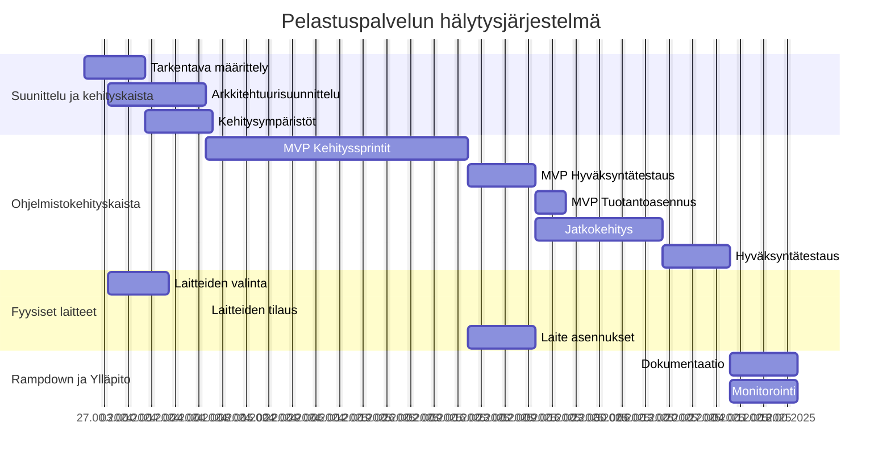

```mermaid
gantt
    title Pelastuspalvelun hälytysjärjestelmä
    axisFormat %d.%M.%Y
    tickInterval 1week
    dateFormat DD.MM.YYYY
    excludes weekends
    
    section Suunittelu ja kehityskaista
      Tarkentava määrittely     	:vat, 21.10.2024, 2w
      Arkkitehtuurisuunnittelu  	:arcdsg, 28.10.2024, 3w
      Kehitysympäristöt         	:after vat, 2w

    section Ohjelmistokehityskaista
      MVP Kehityssprintit         	:mvpdev, after arcdsg, 8w
      MVP Hyväksyntätestaus       	:mvptest, after mvpdev, 2w
      MVP Tuotantoasennus         	:after mvptest, 1w
      
      Jatkokehitys                	:extdev, after mvptest, 4w
      Hyväksyntätestaus           	:finaltest, after extdev, 2w

    section Fyysiset laitteet
      Laitteiden valinta      		:28.10.2024, 2w
      Laitteiden tilaus       		:after arcdsg, 1week
      Laite asennukset        		:after mvpdev, 2w
    
    section Rampdown ja Ylläpito
      Dokumentaatio             	:docs, after finaltest, 2w
      Monitorointi              	:mon, after finaltest, 2w
      
      

```

    